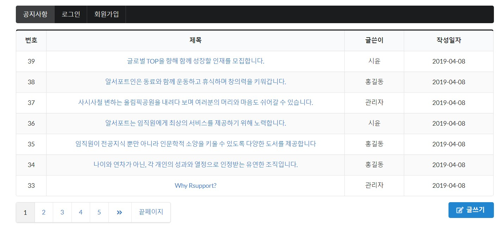
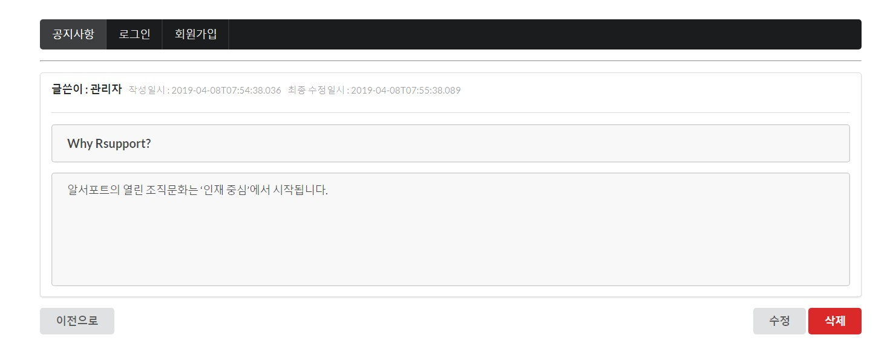

# notice-board
notice board : 공지사항 게시판
- java 8, spring boot 2.1.3, JPA, JUnit, spring security, thymeleaf

# 실행방법
- DBMS는 H2(in-memory)로 되어있습니다.
- 현재 github에 올라가있는 application.properties 파일에 설정되어 있는 jdbc:h2:mem:test;로 접속하시면 됩니다. 사용자명은 sa, 비밀번호는 없습니다.
- data.sql에 샘플데이터가 들어가있습니다. 페이징처리를 보여드리기 위한 충분한 게시글이 있고, ADMIN 계정이 들어갑니다. 
- ADMIN 계정으로 접속을 원하시면 admin@notice.com 이메일을 사용하고 비밀번호는 1234 입니다.

# 시연화면

